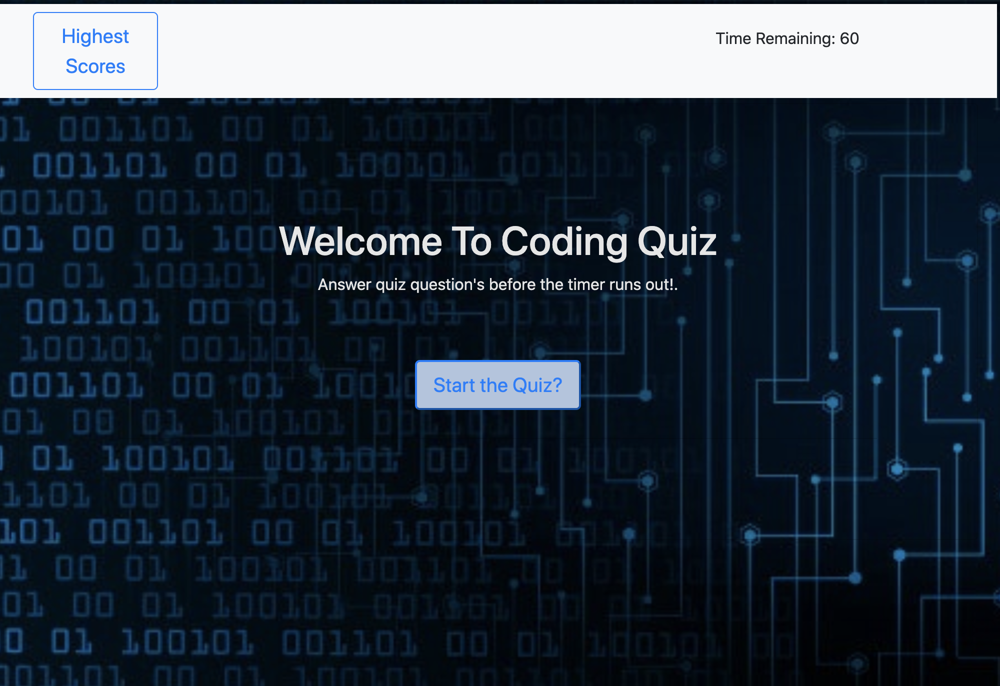

# TITLE

Code Quiz

## Contents

  The app is composed of 3 pages, index.html, javascript.js and style.css. It may contain images in the img folder

## User Story

  As a type of user, Quiz Game that functions on the click, with a highest score stored with local storage.

## Built With

- [VScode](https://code.visualstudio.com/) - The editor of choice.
- [Terminal](https:///) - What would we do without our bash.

#### Initial interface

#### Final Interface

-

### Licence

https://github.com/Michaelmw17/w4homework/blob/master/LICENSE

### Link to the App

<a href=".">https://michaelmw17.github.io/w4homework/</a>

## Authors

- **FIRST LAST** -
  Michael Watt

michaelmw17@outlook.com

## Acknowledgments/Sources

- textContent vs innerHTML/innerText

  - https://developer.mozilla.org/en-US/docs/Web/API/Element/innerHTML
  - https://developer.mozilla.org/en-US/docs/Web/API/Node/textContent#Differences_from_innerText

- Local Storage

  - https://developer.mozilla.org/en-US/docs/Web/API/Window/localStorage

- Timers

  - https://medium.com/@monica1109/scheduling-settimeout-and-setinterval-ca2ee50cd99f

- Accessing array items
  - https://developer.mozilla.org/en-US/docs/Web/JavaScript/Reference/Global_Objects/Array/prototype
  - https://developer.mozilla.org/en-US/docs/Web/JavaScript/Reference/Global_Objects/Array/forEach
  - https://developer.mozilla.org/en-US/docs/Web/JavaScript/Reference/Global_Objects/Array
